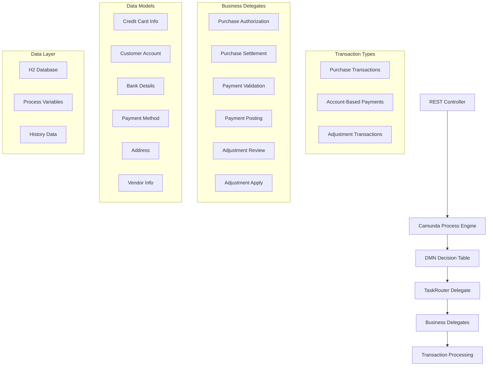

# Camunda Transaction Processing Workflow - Complete Documentation

## Table of Contents
1. [Overview](#overview)
2. [Architecture](#architecture)
3. [Project Structure](#project-structure)
4. [Transaction Types](#transaction-types)
5. [Data Models](#data-models)
6. [Components](#components)
7. [Business Logic](#business-logic)
8. [Getting Started](#getting-started)
9. [API Reference](#api-reference)
10. [Configuration](#configuration)
11. [Testing](#testing)
12. [Deployment](#deployment)
13. [Monitoring & Administration](#monitoring--administration)
14. [Troubleshooting](#troubleshooting)
15. [Future Enhancements](#future-enhancements)

## Overview

The Camunda Transaction Processing Workflow is a comprehensive enterprise-grade application that demonstrates advanced Business Process Management (BPM) using Camunda Platform. This system processes three distinct types of financial transactions through intelligent workflows with dynamic routing based on business rules.

### Key Features
- **Dual Transaction Processing**: 
  - Credit card transactions (Purchase/Adjustment)
  - Account-based payments (Monthly payments to credit card accounts)
- **Dynamic Transaction Routing**: Uses DMN (Decision Model and Notation) for flexible business rule management
- **Comprehensive Data Models**: Full credit card info, customer accounts, bank details, payment methods
- **Parallel & Sequential Processing**: Configurable execution patterns based on transaction type
- **Account-Based Payment Processing**: Complete customer account management with bank transfer capabilities
- **Advanced Validation**: Multi-level validation for credit cards, accounts, and bank details
- **Real-time Monitoring**: Built-in process monitoring via Camunda Cockpit
- **Extensible Design**: Easy to add new transaction types and processing logic

### Technology Stack
- **Framework**: Spring Boot 2.7.18
- **BPM Engine**: Camunda Platform 7.18.0
- **Database**: H2 (in-memory, configurable for production databases)
- **Java Version**: 17+
- **Build Tool**: Maven 3.6+
- **Web Interface**: Camunda Cockpit for process monitoring

## Architecture



### Process Flow
1. **REST Request**: Client initiates transaction via REST endpoint (`/process` or `/payment`)
2. **Process Start**: Camunda engine starts the appropriate transaction processing workflow
3. **DMN Evaluation**: Decision table determines the execution path based on transaction type
4. **Task Routing**: TaskRouterDelegate orchestrates sequential or parallel task execution
5. **Business Logic**: Individual delegates handle specific business operations with full data context
6. **Completion**: Process completes with full audit trail and updated account balances

## Project Structure

```
camunda-transaction-processor-full/
├── src/
│   ├── main/
│   │   ├── java/
│   │   │   └── com/example/transactionprocessor/
│   │   │       ├── TransactionProcessorApplication.java
│   │   │       ├── controller/
│   │   │       │   └── TransactionController.java
│   │   │       ├── model/
│   │   │       │   ├── TransactionRequest.java
│   │   │       │   ├── PaymentTransactionRequest.java
│   │   │       │   ├── CreditCardInfo.java
│   │   │       │   ├── CustomerAccount.java
│   │   │       │   ├── BankDetails.java
│   │   │       │   ├── PaymentMethod.java
│   │   │       │   ├── Address.java
│   │   │       │   └── VendorInfo.java
│   │   │       └── delegate/
│   │   │           ├── TaskRouterDelegate.java
│   │   │           ├── PurchaseAuthorizationDelegate.java
│   │   │           ├── PurchaseSettlementDelegate.java
│   │   │           ├── PaymentValidationDelegate.java
│   │   │           ├── PaymentPostingDelegate.java
│   │   │           ├── AdjustmentReviewDelegate.java
│   │   │           └── AdjustmentApplyDelegate.java
│   │   └── resources/
│   │       ├── application.yml
│   │       ├── transactionProcessingDMNBased.bpmn
│   │       └── DetermineTransactionPath.dmn
│   └── test/
│       └── java/
│           └── com/example/transactionprocessor/
│               ├── TransactionProcessorApplicationTest.java
│               └── delegate/
│                   └── TaskRouterDelegateTest.java
├── target/
├── Camunda_Transaction_Processor_Complete.postman_collection.json
├── example-requests.json
├── pom.xml
├── README.md
└── DOCUMENTATION.md
```

## Transaction Types

### 1. Purchase Transactions
**Purpose**: Process credit card purchases at merchants
**Endpoint**: `POST /transactions/process`
**Flow**: authorize → settle
**Data Requirements**: Credit card info, billing address, vendor details

**Example**:
```json
{
  "transactionType": "Purchase",
  "amount": 125.50,
  "creditCardInfo": {
    "cardNumber": "4111111111111111",
    "holderName": "John Smith",
    "cardType": "VISA"
  },
  "vendorInfo": {
    "name": "Amazon Store",
    "merchantId": "AMZ123456"
  }
}
```

### 2. Account-Based Payments
**Purpose**: Process monthly payments to customer credit card accounts
**Endpoint**: `POST /transactions/payment`
**Flow**: validate → post
**Data Requirements**: Customer account info, payment method, bank details

**Example**:
```json
{
  "transactionType": "Payment",
  "paymentAmount": 350.00,
  "customerAccount": {
    "accountNumber": "4532123456789012",
    "customerName": "Sarah Johnson",
    "currentBalance": 2450.75,
    "minimumPaymentDue": 125.00
  },
  "paymentMethod": {
    "paymentType": "ACH",
    "bankDetails": {
      "bankName": "Chase Bank",
      "routingNumber": "021000021",
      "accountNumber": "1234567890"
    }
  }
}
```

### 3. Adjustment Transactions
**Purpose**: Process refunds and account corrections
**Endpoint**: `POST /transactions/process`
**Flow**: review → apply
**Data Requirements**: Credit card info, adjustment reason, reference details

**Example**:
```json
{
  "transactionType": "Adjustment",
  "amount": -25.00,
  "description": "Refund for cancelled order",
  "creditCardInfo": {
    "cardNumber": "378282246310005",
    "holderName": "Michael Johnson"
  }
}
```

## Data Models

### CreditCardInfo
```java
public class CreditCardInfo {
    private String cardNumber;      // Masked for security
    private String holderName;
    private LocalDate expiryDate;
    private String cvv;            // Not logged
    private String cardType;       // VISA, MASTERCARD, AMEX
}
```

### CustomerAccount
```java
public class CustomerAccount {
    private String accountNumber;          // Customer credit card account
    private String customerName;
    private String customerEmail;
    private String customerPhone;
    private String accountType;            // CREDIT, CHECKING, SAVINGS
    private BigDecimal currentBalance;
    private BigDecimal creditLimit;
    private BigDecimal minimumPaymentDue;
    private LocalDate paymentDueDate;
    private String accountStatus;          // ACTIVE, SUSPENDED, CLOSED
}
```

### BankDetails
```java
public class BankDetails {
    private String bankName;
    private String routingNumber;          // 9-digit routing number
    private String accountNumber;          // Masked for security
    private String accountHolderName;
    private String accountType;            // CHECKING, SAVINGS
    private Address bankAddress;
}
```

### PaymentMethod
```java
public class PaymentMethod {
    private String paymentType;            // ACH, BANK_TRANSFER, WIRE, ONLINE_BANKING
    private BankDetails bankDetails;
    private boolean isDefault;
    private String paymentMethodId;
    private String nickname;               // User-friendly name
}
```

## Components

### 1. TransactionController
**Purpose**: REST endpoints for initiating transaction processes

**Key Methods**:
- `processTransaction(TransactionRequest)`: Handles purchases and adjustments
- `processPayment(PaymentTransactionRequest)`: Handles account-based payments
- `startTransaction(String)`: Legacy endpoint for backward compatibility

**Endpoints**:
```bash
# Credit card transactions (purchase/adjustment)
POST /transactions/process

# Account-based payments
POST /transactions/payment

# Legacy endpoint
POST /transactions/start?transactionType=Purchase
```

### 2. TaskRouterDelegate
**Purpose**: Central orchestrator that manages task execution patterns

**Key Features**:
- Dynamic task parsing from DMN output
- Support for sequential and parallel execution
- Delegate lookup and invocation
- Comprehensive variable debugging
- Error handling and logging

**Variable Mapping**:
- Maps transaction data to process variables
- Handles both credit card and account-based data
- Provides masked sensitive information for logging

### 3. Enhanced Business Delegates

#### Purchase Flow Delegates
**PurchaseAuthorizationDelegate**:
- Validates credit card information
- Checks transaction limits and fraud rules
- Generates authorization codes
- Supports different card types (VISA, Mastercard, AMEX)

**PurchaseSettlementDelegate**:
- Processes authorized transactions
- Handles vendor payments
- Updates transaction records
- Generates settlement IDs

#### Payment Flow Delegates  
**PaymentValidationDelegate**:
- Validates customer account status
- Verifies bank details (routing numbers, account info)
- Checks payment amounts against minimums
- Validates payment method details

**PaymentPostingDelegate**:
- Processes bank transfers (ACH, Wire, Online Banking)
- Updates customer account balances
- Calculates new balance after payment
- Handles different payment types (minimum, full balance, custom)

#### Adjustment Flow Delegates
**AdjustmentReviewDelegate**:
- Reviews adjustment requests
- Applies business rules for approval
- Handles high-value adjustments requiring manual review
- Validates adjustment reasons

**AdjustmentApplyDelegate**:
- Applies approved adjustments
- Updates account balances
- Creates adjustment records
- Generates adjustment IDs

### 4. DMN Decision Table
**File**: `DetermineTransactionPath.dmn`

**Decision Logic**:
```
Input: transactionType (String)
Output: taskFlow (String)

Rules:
├── Purchase → "authorize,settle"
├── Payment → "validate,post"  
└── Adjustment → "review,apply"
```

**Enhanced Rules Support**:
- Configurable task flows
- Support for parallel execution patterns
- Easy addition of new transaction types

### 5. BPMN Process
**File**: `transactionProcessingDMNBased.bpmn`

**Process Steps**:
1. **Start Event**: Process initiation with transaction data
2. **Business Rule Task**: DMN evaluation with proper result mapping
3. **Service Task**: Task routing via TaskRouterDelegate
4. **End Event**: Process completion with full audit trail

**Key Configuration**:
```xml
<bpmn:businessRuleTask id="DetermineTransactionPath" 
                      name="Determine Task Flow" 
                      camunda:decisionRef="DeterminePath" 
                      camunda:resultVariable="dmnResult" 
                      camunda:mapDecisionResult="singleEntry">
```

## Business Logic

### Enhanced Transaction Processing

#### 1. Purchase Transactions
```
Flow: Purchase → authorize,settle
Authorization Logic:
- Validates credit card details
- Checks transaction amounts (deny > $10,000 for demo)
- Verifies card type specific rules
- Generates authorization codes

Settlement Logic:
- Requires successful authorization
- Processes funds transfer to vendor
- Updates transaction status
- Generates settlement IDs
```

#### 2. Account-Based Payments  
```
Flow: Payment → validate,post
Validation Logic:
- Verifies account status (must be ACTIVE)
- Validates customer information
- Checks bank routing numbers (must be 9 digits)
- Compares payment amount to minimum due

Posting Logic:
- Processes ACH/Bank transfers
- Updates customer account balance
- Calculates new balance after payment
- Handles different payment methods
```

#### 3. Adjustment Transactions
```
Flow: Adjustment → review,apply
Review Logic:
- Checks adjustment amounts (> $5,000 requires manual review)
- Validates adjustment descriptions
- Applies business approval rules
- Generates review IDs

Apply Logic:
- Requires approved review status
- Updates account balances
- Creates adjustment records
- Generates adjustment IDs
```

### Advanced Validation Features

#### Credit Card Validation
- Card number masking for security
- Card type specific validations
- Expiry date verification
- CVV handling (never logged)

#### Account Validation
- Account status verification
- Balance and limit checks
- Payment due date validation
- Contact information verification

#### Bank Details Validation
- Routing number format validation
- Account holder name matching
- Bank information verification
- Payment method type validation

## Getting Started

### Prerequisites
```bash
# Java 17 or higher
java -version

# Maven 3.6 or higher  
mvn -version

# Git (for cloning)
git --version
```

### Installation

1. **Clone the Repository**
```bash
git clone <repository-url>
cd camunda-transaction-processor-full
```

2. **Build the Project**
```bash
mvn clean install
```

3. **Run the Application**
```bash
mvn spring-boot:run
# OR
java -jar target/transaction-processor-1.0.0.jar
```

4. **Access Camunda Cockpit**
```
URL: http://localhost:8080
Username: demo
Password: demo
```

5. **Verify Installation**
```bash
# Test purchase transaction
curl -X POST "http://localhost:8080/transactions/start?transactionType=Purchase"

# Test with full data (see Postman collection for complete examples)
```

### Quick Start Examples

#### Purchase Transaction
```bash
curl -X POST http://localhost:8080/transactions/process \
  -H "Content-Type: application/json" \
  -d '{
    "transactionType": "Purchase",
    "amount": 125.50,
    "currency": "USD",
    "creditCardInfo": {
      "cardNumber": "4111111111111111",
      "holderName": "John Smith",
      "cardType": "VISA"
    },
    "vendorInfo": {
      "name": "Amazon Store",
      "merchantId": "AMZ123456"
    }
  }'
```

#### Account Payment
```bash
curl -X POST http://localhost:8080/transactions/payment \
  -H "Content-Type: application/json" \
  -d '{
    "transactionType": "Payment",
    "paymentAmount": 350.00,
    "customerAccount": {
      "accountNumber": "4532123456789012",
      "customerName": "Sarah Johnson",
      "accountStatus": "ACTIVE"
    },
    "paymentMethod": {
      "paymentType": "ACH",
      "bankDetails": {
        "bankName": "Chase Bank",
        "routingNumber": "021000021"
      }
    }
  }'
```

## API Reference

### REST Endpoints

#### Process Transactions (Purchase/Adjustment)
- **URL**: `/transactions/process`
- **Method**: `POST`
- **Content-Type**: `application/json`
- **Body**: `TransactionRequest` object
- **Response**: JSON with process details

**TransactionRequest Fields**:
- `transactionType`: "Purchase" | "Adjustment"
- `amount`: Transaction amount (BigDecimal)
- `currency`: Currency code (default: "USD")
- `creditCardInfo`: Credit card details
- `billingAddress`: Billing address information
- `vendorInfo`: Vendor/merchant details (for purchases)
- `description`: Transaction description
- `referenceNumber`: Unique reference number

#### Process Payments (Account-Based)
- **URL**: `/transactions/payment`
- **Method**: `POST`
- **Content-Type**: `application/json`
- **Body**: `PaymentTransactionRequest` object
- **Response**: JSON with payment details

**PaymentTransactionRequest Fields**:
- `transactionType`: "Payment"
- `paymentAmount`: Payment amount (BigDecimal)
- `currency`: Currency code (default: "USD")
- `paymentDate`: Scheduled payment date
- `customerAccount`: Customer account details
- `paymentMethod`: Payment method and bank details
- `paymentType`: "MINIMUM_PAYMENT" | "FULL_BALANCE" | "CUSTOM_AMOUNT"
- `isRecurring`: Boolean for recurring payments
- `recurringFrequency`: "MONTHLY" | "WEEKLY" | "QUARTERLY"

#### Legacy Endpoint
- **URL**: `/transactions/start`
- **Method**: `POST`
- **Parameters**: `transactionType` (query parameter)
- **Response**: Plain text confirmation

### Response Formats

#### Success Response (Process)
```json
{
  "status": "success",
  "message": "Transaction process started successfully",
  "processInstanceId": "12345678-1234-5678-9012-123456789012",
  "transactionType": "Purchase",
  "amount": 125.50,
  "referenceNumber": "REF123456789"
}
```

#### Success Response (Payment)
```json
{
  "status": "success",
  "message": "Payment process started successfully",
  "processInstanceId": "87654321-4321-8765-4321-876543218765",
  "transactionType": "Payment",
  "paymentAmount": 350.00,
  "customerAccount": "****-****-****-9012",
  "paymentMethod": "Main Checking"
}
```

#### Error Response
```json
{
  "status": "error",
  "message": "Error processing transaction: Validation failed"
}
```

### Process Variables Reference

| Variable Name | Type | Description | Example |
|---------------|------|-------------|---------|
| **Common Variables** |
| `transactionType` | String | Type of transaction | "Purchase", "Payment", "Adjustment" |
| `processInstanceId` | String | Unique process identifier | UUID string |
| **Purchase/Adjustment Variables** |
| `amount` | BigDecimal | Transaction amount | 125.50 |
| `creditCardNumber` | String | Masked card number | "**** **** **** 1111" |
| `cardHolderName` | String | Card holder name | "John Smith" |
| `cardType` | String | Card type | "VISA", "MASTERCARD", "AMEX" |
| `vendorName` | String | Vendor name | "Amazon Store" |
| `vendorLocation` | String | Vendor location | "Online" |
| **Payment Variables** |
| `paymentAmount` | BigDecimal | Payment amount | 350.00 |
| `customerAccountNumber` | String | Customer account | "4532123456789012" |
| `customerName` | String | Customer name | "Sarah Johnson" |
| `accountStatus` | String | Account status | "ACTIVE", "SUSPENDED" |
| `currentBalance` | BigDecimal | Current balance | 2450.75 |
| `minimumPaymentDue` | BigDecimal | Minimum payment | 125.00 |
| `paymentMethodType` | String | Payment method | "ACH", "BANK_TRANSFER" |
| `bankName` | String | Bank name | "Chase Bank" |
| `routingNumber` | String | Bank routing number | "021000021" |
| **Result Variables** |
| `authorized` | Boolean | Authorization result | true/false |
| `authorizationCode` | String | Authorization code | "AUTH123456" |
| `settlementStatus` | String | Settlement status | "SETTLED" |
| `settlementId` | String | Settlement ID | "SETTLE789012" |
| `validationResult` | Boolean | Validation result | true/false |
| `validationCode` | String | Validation code | "VAL456789" |
| `postingStatus` | String | Posting status | "POSTED" |
| `postingId` | String | Posting ID | "POST345678" |
| `newBalance` | BigDecimal | Updated balance | 2100.75 |

## Configuration

### Application Configuration (`application.yml`)

```yaml
spring:
  datasource:
    url: jdbc:h2:mem:camunda;DB_CLOSE_DELAY=-1
    driver-class-name: org.h2.Driver
    username: sa
    password:
  jpa:
    hibernate:
      ddl-auto: update

camunda:
  bpm:
    database:
      schema-update: create
    admin-user:
      id: demo
      password: demo
      first-name: Demo
      last-name: User
    metrics:
      enabled: true
    job-execution:
      enabled: true
    webapp:
      enabled: true
      index-redirect-enabled: true
```

### Environment-Specific Configurations

#### Development
```yaml
spring:
  profiles: dev
  datasource:
    url: jdbc:h2:mem:camunda-dev

logging:
  level:
    com.example.transactionprocessor: DEBUG
    org.camunda.bpm: INFO
```

#### Production
```yaml
spring:
  profiles: prod
  datasource:
    url: jdbc:postgresql://localhost:5432/camunda_prod
    username: ${DB_USERNAME}
    password: ${DB_PASSWORD}

camunda:
  bpm:
    database:
      schema-update: false
    metrics:
      enabled: true
      db-reporter-activate: true
    webapp:
      enabled: true
```

## Testing

### Postman Collection

The project includes a comprehensive Postman collection: `Camunda_Transaction_Processor_Complete.postman_collection.json`

**Collection Structure**:
- **Credit Card Transactions**: Purchase and adjustment scenarios
- **Account-Based Payments**: Monthly payments, minimum payments, full balance payments
- **Error Testing**: Validation failures and error conditions
- **Legacy & Utilities**: Backward compatibility tests

**Key Test Scenarios**:
1. Standard purchase with VISA card
2. Monthly credit card payment via ACH
3. Minimum payment via bank transfer
4. Full balance payment via online banking
5. High-value purchase denial (fraud prevention)
6. Invalid account status (suspended account)
7. Invalid routing number validation
8. Below minimum payment warning

### Unit Tests

Run all tests:
```bash
mvn test
```

Run specific test class:
```bash
mvn test -Dtest=TaskRouterDelegateTest
```

### Integration Testing

**Complete Workflow Testing**:
```bash
# Start the application
mvn spring-boot:run

# Import Postman collection and run tests
# Or use curl commands for individual testing
```

**Validation Testing**:
- Credit card validation scenarios
- Account status verification
- Bank details validation
- Payment amount validation
- Business rule testing

### Test Coverage

Current test coverage includes:
- **TaskRouterDelegate**: 100% method coverage
- **Business Delegates**: Individual unit tests with mocks
- **Application Context**: Startup and configuration tests
- **Integration Tests**: End-to-end process execution
- **Validation Tests**: All validation scenarios
- **Error Handling**: Exception and error condition testing

## Deployment

### Local Deployment

1. **Build JAR**:
```bash
mvn clean package
```

2. **Run JAR**:
```bash
java -jar target/transaction-processor-1.0.0.jar
```

3. **Access Application**:
- Application: `http://localhost:8080/transactions`
- Camunda Cockpit: `http://localhost:8080` (demo/demo)

### Docker Deployment

Create `Dockerfile`:
```dockerfile
FROM openjdk:17-jdk-slim
COPY target/transaction-processor-1.0.0.jar app.jar
EXPOSE 8080
ENTRYPOINT ["java", "-jar", "/app.jar"]
```

Build and run:
```bash
docker build -t transaction-processor .
docker run -p 8080:8080 transaction-processor
```

### Production Deployment

1. **Database Setup** (PostgreSQL):
```sql
CREATE DATABASE camunda_prod;
CREATE USER camunda_user WITH PASSWORD 'secure_password';
GRANT ALL PRIVILEGES ON DATABASE camunda_prod TO camunda_user;
```

2. **Environment Variables**:
```bash
export DB_USERNAME=camunda_user
export DB_PASSWORD=secure_password
export SPRING_PROFILES_ACTIVE=prod
```

3. **Production Configuration**:
```yaml
# application-prod.yml
spring:
  datasource:
    url: jdbc:postgresql://localhost:5432/camunda_prod
    username: ${DB_USERNAME}
    password: ${DB_PASSWORD}
    
camunda:
  bpm:
    database:
      schema-update: false
    metrics:
      enabled: true
      db-reporter-activate: true
```

## Monitoring & Administration

### Camunda Cockpit

**Access Information**:
- **URL**: `http://localhost:8080`
- **Username**: `demo`
- **Password**: `demo`

**Available Features**:
- **Process Instances**: Monitor running and completed processes
- **Process Definitions**: View deployed BPMN processes
- **Decision Tables**: View and test DMN decision tables
- **Deployments**: Manage BPMN and DMN deployments
- **User Management**: Manage users and permissions
- **Metrics**: View process execution metrics

### Process Monitoring

**Key Metrics to Monitor**:
- **Process Instance Duration**: Average processing time by transaction type
- **Success/Failure Rates**: Monitor process completion rates
- **Decision Evaluation**: DMN decision success rates
- **Delegate Performance**: Individual task execution times
- **Queue Depth**: Number of pending process instances

**Process Variables Monitoring**:
- Transaction amounts and types
- Authorization success rates
- Payment processing success rates
- Account validation success rates

### Application Monitoring

**Health Checks**:
```bash
# Application health
curl http://localhost:8080/actuator/health

# Application metrics
curl http://localhost:8080/actuator/metrics

# Process engine health
curl http://localhost:8080/actuator/health/camunda
```

**Logging Configuration**:
```yaml
logging:
  level:
    com.example.transactionprocessor: INFO
    org.camunda.bpm: WARN
    org.springframework: INFO
  pattern:
    console: "%d{yyyy-MM-dd HH:mm:ss} - %msg%n"
    file: "%d{yyyy-MM-dd HH:mm:ss} [%thread] %-5level %logger{36} - %msg%n"
```

## Troubleshooting

### Common Issues

#### 1. Application Startup Issues

**Problem**: Port 8080 already in use
```bash
# Solution 1: Kill existing process
lsof -ti:8080 | xargs kill -9

# Solution 2: Use different port
java -jar -Dserver.port=8081 target/transaction-processor-1.0.0.jar
```

**Problem**: Database connection errors
```bash
# Check H2 database configuration
# Ensure DB_CLOSE_DELAY=-1 is set
```

#### 2. DMN Decision Issues

**Problem**: `dmnResult` variable is null
```xml
<!-- Ensure correct DMN result mapping -->
<bpmn:businessRuleTask 
    camunda:resultVariable="dmnResult" 
    camunda:mapDecisionResult="singleEntry">
```

**Problem**: DMN table not found
- Verify DMN file is in `src/main/resources/`
- Check decision reference name matches exactly

#### 3. Delegate Execution Issues

**Problem**: Delegate not found
```java
// Ensure correct component annotation
@Component("purchaseAuthorizationDelegate")
public class PurchaseAuthorizationDelegate implements JavaDelegate {
```

**Problem**: Variable mapping issues
- Check variable names match exactly between controller and delegates
- Verify data types are compatible
- Use debug logging to trace variable values

#### 4. Validation Failures

**Problem**: Credit card validation fails
- Verify card number format and length
- Check card holder name is not empty
- Ensure card type is supported

**Problem**: Account validation fails
- Verify account status is "ACTIVE"
- Check routing number is 9 digits
- Ensure customer information is complete

**Problem**: Payment amount validation fails
- Verify payment amount is positive
- Check against minimum payment requirements
- Ensure account balance is sufficient

### Debug Mode

**Enable Debug Logging**:
```bash
java -jar -Dlogging.level.com.example.transactionprocessor=DEBUG target/transaction-processor-1.0.0.jar
```

**Process Variable Debugging**:
The TaskRouterDelegate includes comprehensive variable debugging:
```
=== Available Variables ===
transactionType = Payment
paymentAmount = 350.0
customerAccountNumber = 4532123456789012
customerName = Sarah Johnson
paymentMethodType = ACH
bankName = Chase Bank
========================
```

**Transaction Flow Debugging**:
Each delegate logs detailed execution information:
```
=== Payment Validation ===
Transaction Type: Payment
Payment Amount: 350.0
Customer Account: ****-****-****-9012
Account Status: ACTIVE
Payment Method: ACH
Bank: Chase Bank
==========================
```

### Performance Troubleshooting

**Memory Issues**:
```bash
# Increase JVM heap size
java -Xmx2g -jar target/transaction-processor-1.0.0.jar
```

**Database Performance**:
```yaml
# Optimize H2 configuration
spring:
  datasource:
    url: jdbc:h2:mem:camunda;DB_CLOSE_DELAY=-1;CACHE_SIZE=10000
```

**Process Performance**:
- Monitor process instance duration in Cockpit
- Check for bottlenecks in specific delegates
- Review parallel execution patterns

## Future Enhancements

### Planned Features

#### 1. Enhanced Transaction Types
- **Chargeback Processing**: Handle dispute transactions
- **Recurring Payments**: Automated recurring payment setup
- **International Transactions**: Multi-currency support
- **Cryptocurrency Payments**: Digital currency integration

#### 2. Advanced Security Features
- **OAuth2 Integration**: Secure API authentication
- **Role-Based Access Control**: Fine-grained permissions
- **PCI DSS Compliance**: Enhanced credit card security
- **Audit Logging**: Comprehensive transaction auditing

#### 3. External System Integration
- **Payment Gateway Integration**: Real payment processing
- **Fraud Detection Services**: Advanced fraud prevention
- **Notification Systems**: Email, SMS, push notifications
- **CRM Integration**: Customer relationship management

#### 4. Enhanced Analytics
- **Prometheus Metrics**: Advanced monitoring
- **Custom Dashboards**: Business intelligence dashboards
- **Predictive Analytics**: Transaction pattern analysis
- **Real-time Reporting**: Live transaction reporting

#### 5. Advanced Workflow Features
- **Complex Parallel Processing**: Advanced parallel workflows
- **Conditional Routing**: Dynamic workflow routing
- **Escalation Handling**: Automated escalation procedures
- **SLA Management**: Service level agreement monitoring

### Customization Guide

#### Adding New Transaction Types

1. **Update DMN Decision Table**:
```xml
<rule id="Rule_NewType">
  <inputEntry><text>"NewTransactionType"</text></inputEntry>
  <outputEntry><text>"validate,process,complete"</text></outputEntry>
</rule>
```

2. **Create Data Model**:
```java
public class NewTransactionRequest {
    private String transactionType;
    private BigDecimal amount;
    // Additional fields specific to new type
}
```

3. **Create Business Delegates**:
```java
@Component("newTransactionValidationDelegate")
public class NewTransactionValidationDelegate implements JavaDelegate {
    @Override
    public void execute(DelegateExecution execution) throws Exception {
        // Implementation for new transaction validation
    }
}
```

4. **Update Controller**:
```java
@PostMapping("/newtransaction")
public ResponseEntity<Map<String, Object>> processNewTransaction(
    @RequestBody NewTransactionRequest request) {
    // Implementation
}
```

5. **Update TaskRouterDelegate**:
```java
private String mapTaskNameToBean(String taskName) {
    switch (taskName.toLowerCase()) {
        case "validate":
            return "newTransactionValidationDelegate";
        // ... existing cases
    }
}
```

#### Implementing Complex Business Rules

**Multi-Step Decision Making**:
```xml
<!-- Multiple DMN tables for complex decisions -->
<bpmn:businessRuleTask id="RiskAssessment" 
                      camunda:decisionRef="RiskEvaluation"/>
<bpmn:businessRuleTask id="RouteDecision" 
                      camunda:decisionRef="TransactionRouting"/>
```

**Dynamic Rule Configuration**:
```java
// External rule engine integration
public class DynamicRuleEngine {
    public String evaluateTransactionRules(TransactionRequest request) {
        // Dynamic rule evaluation
    }
}
```

#### Performance Optimization

**Database Optimization**:
```yaml
# Production database configuration
spring:
  datasource:
    hikari:
      maximum-pool-size: 20
      minimum-idle: 5
      connection-timeout: 30000
```

**Parallel Processing Optimization**:
```java
// Custom thread pool configuration
@Configuration
public class ProcessingConfiguration {
    @Bean
    public Executor taskExecutor() {
        ThreadPoolTaskExecutor executor = new ThreadPoolTaskExecutor();
        executor.setCorePoolSize(10);
        executor.setMaxPoolSize(20);
        return executor;
    }
}
```

---

## Contact & Support

**Project Information**:
- **Documentation**: This file serves as the comprehensive documentation
- **Examples**: See Postman collection and test files for usage examples
- **Configuration**: Reference application.yml for configuration options

**Testing Resources**:
- **Postman Collection**: `Camunda_Transaction_Processor_Complete.postman_collection.json`
- **Example Requests**: `example-requests.json`
- **Unit Tests**: Located in `src/test/java/`

**Monitoring Resources**:
- **Camunda Cockpit**: `http://localhost:8080` (demo/demo)
- **Health Checks**: `http://localhost:8080/actuator/health`
- **Metrics**: `http://localhost:8080/actuator/metrics`

---

*Last Updated: 2025-07-05*  
*Version: 2.0.0*  
*Features: Complete Transaction Processing with Account-Based Payments*